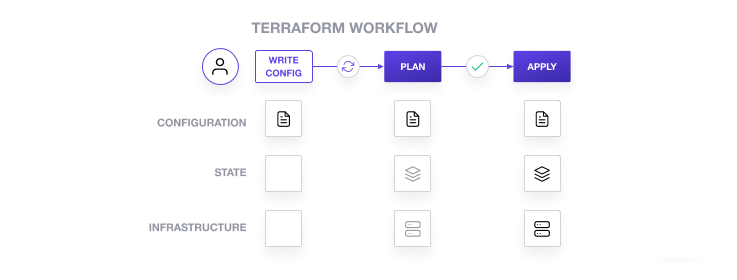

# Import existing Cognito user pool & client using import blocks

Terraform processes the import block during the plan stage.
Once a plan is approved, Terraform imports the resource into its state during the subsequent apply stage.

To import a resource using import blocks, you must:

1. Define an import block for the resource(s).
2. Add a corresponding resource block to your configuration , or generate configuration for that resource.
3. Run `terraform plan` to review how Terraform will import the resource(s).
4. Apply the configuration to import the resources and update your Terraform state.



The import block is **idempotent**, meaning that applying an import action and running another plan will not generate 
another import action as long as that resource remains in your state.

Terraform only needs to import a given resource once.
Attempting to import a resource into the same address again is a harmless no-op.
You can remove import blocks after completing the import or safely leave them in your configuration as a record of the 
resource's origin for future module maintainers.

## Terraform init

```shell
export AWS_PROFILE=val
aws sso login

cd ~/work/github/terraform-import
            
# Code formatting
terraform -chdir=cognito-import-block fmt -recursive

# Initialize modules & provider plugins. Downloads provider and locks the versions in .terraform.lock.hcl file
# This init only needs to be run when a fresh copy of the repository has been cloned.
# Use -upgrade flag instead if upgrading Terraform version.
terraform -chdir=cognito-import-block init -var-file ../env_files/val-dev.tfvars -reconfigure
# OR for S3 based backend
terraform -chdir=cognito-import-block init -backend-config ../env_files/val-dev.tfbackend -var-file ../env_files/val-dev.tfvars -reconfigure
```

## Initialize Terraform configuration files

```shell
# provider.tf file configures the Cognito provider.
# cognito-user-pool.tf file will contain the configuration necessary to manage the Cognito user pool we created manually.
# Navigate to cognito-user-pool.tf and define an empty user pool resource:
vim cognito-import-block/cognito-user-pool.tf

resource "aws_cognito_user_pool" "val-user-pool" {}
```

## Import resources

```shell
terraform -chdir=cognito-import-block plan -var-file ../env_files/val-dev.tfvars -generate-config-out=generated.tf
```

Terraform used the `aws` provider to find a user pool resource with the ID you specified in the import block.
It then saved the resource definition to `generated.tf`.

Notice that Terraform plans to replace the user pool after import due to the default value of the env parameter returned 
by the provider.
We will fix this in the next section to ensure Terraform imports the container without making destructive changes to it.

Open `generated.tf` to review the generated configuration.

Once the import is done, plan|apply as follows:

```shell
terraform -chdir=cognito-import-block validate -var-file env_files/val-dev.tfvars
terraform -chdir=cognito-import-block apply -var-file env_files/val-dev.tfvars
```
