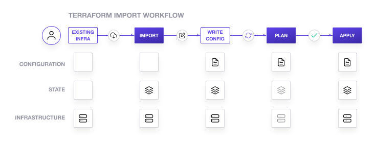

# Import existing Cognito user pool & client using import command

The `terraform import` CLI command can only import resources into the state.
Importing via the CLI does not generate configuration.
Bringing existing infrastructure under Terraform’s control involves five main steps:

1. Identify the existing infrastructure to be imported.
2. Import the infrastructure into our Terraform state.
3. Write a Terraform configuration that matches that infrastructure.
4. Review the Terraform plan to ensure that the configuration matches the expected state and infrastructure.
5. Apply the configuration to update our Terraform state.



## Terraform init

```shell
export AWS_PROFILE=val
aws sso login

cd ~/work/github/terraform-import

# Code formatting
terraform -chdir=cognito-import-command fmt -recursive

# Initialize modules & provider plugins. Downloads provider and locks the versions in .terraform.lock.hcl file
# This init only needs to be run when a fresh copy of the repository has been cloned.
# Use -upgrade flag instead if upgrading Terraform version.
terraform -chdir=cognito-import-command init -var-file ../env_files/val-dev.tfvars -reconfigure
# OR for S3 based backend
terraform -chdir=cognito-import-command init -backend-config ../env_files/val-dev.tfbackend -var-file ../env_files/val-dev.tfvars -reconfigure
```

## Initialize Terraform configuration files

```shell
# provider.tf file configures the Cognito provider.
# cognito-user-pool.tf file will contain the configuration necessary to manage the Cognito user pool we created manually.
# Navigate to cognito-user-pool.tf and define an empty user pool resource:
vim cognito-import-command/cognito-user-pool.tf

resource "aws_cognito_user_pool" "val-user-pool" {}
```

## Import resources

```shell
# Terraform import requires the Terraform resource ID and the full User pool ID to import
# Find the ID of the user pool we want to import from AWS console

# Run the following terraform import command to attach the existing User pool to the aws_cognito_user_pool.val-user-pool resource we just created.
# Usage: `terraform import [options] ADDRESS ID`
terraform -chdir=cognito-import-command import -var-file ../env_files/val-dev.tfvars aws_cognito_user_pool.val-user-pool us-east-1_7VInaxxDB

# Verify that the user pool has been imported into our Terraform state:
terraform -chdir=cognito-import-command show

# This state contains everything that Terraform knows about the User pool we just imported.
However, Terraform import does not create the configuration for the resource.
```

## Create configuration from state

We’ll need to create Terraform configuration before we can use Terraform to manage this user pool.

```shell
terraform -chdir=cognito-import-command plan -var-file ../env_files/val-dev.tfvars
```

Copied!
Note: Terraform will show errors for the missing required argument name.
Terraform cannot generate a plan for a resource that is missing required arguments.
There are two approaches to update the configuration in `cognito-user-pool.tf` to match the state we imported.
We can either accept the entire current state of the resource into our configuration as-is or select the required 
attributes into our configuration individually.
Each of these approaches can be useful in different circumstances.

Using the current state is often faster, but can result in an overly verbose configuration because every attribute is 
included in the state, whether it is necessary to include in our configuration or not.

Individually selecting the required attributes can lead to more manageable configuration, but requires we to understand 
which attributes need to be set in the configuration.

For this example, we will use the current state as the resource.

Copy our Terraform state into our cognito-user-pool.tf file:

```shell
terraform -chdir=cognito-import-command show -no-color > cognito-import-command/cognito-user-pool.tf
```

Note: The > symbol will replace the entire contents of `cognito-user-pool.tf` with the output of the terraform show command.
Although this works for this example, importing a resource into a configuration that already manages resources will 
require us to edit the output of `terraform show` to remove existing resources whose configuration we do not want to 
replace completely and merge the new resources into our existing configuration.

Run the following code:

```shell
terraform -chdir=cognito-import-command plan -var-file ../env_files/val-dev.tfvars
```

Terraform will show warnings and errors about several read-only arguments (id, arn, creation_date, last_modified_date, 
domain, endpoint, estimated_number_of_users).

These read-only arguments are values that Terraform stores in its state for Docker containers but that it cannot set via 
configuration because they are managed internally by Docker.

Because the approach shown here loads all the attributes represented in Terraform state, our configuration includes 
optional attributes whose values are the same as their defaults.
Which attributes are optional, and their default values, will vary from provider to provider, and are listed in the 
provider documentation.

We can now selectively remove these optional attributes.
Remove all of these attributes, keeping only the required attributes.

When importing real infrastructure, consult the provider documentation to learn what each argument does.
This will help us to determine how to handle any errors or warnings from the plan step.

```shell
terraform -chdir=cognito-import-command validate -var-file ../env_files/val-dev.tfvars
terraform -chdir=cognito-import-command plan -var-file ../env_files/val-dev.tfvars
```

The plan should now execute successfully.

Apply the changes and finish the process of syncing our updated Terraform configuration and state with the Docker 
container they represent. Type yes at the prompt to confirm.

```shell
terraform -chdir=cognito-import-command apply -var-file ../env_files/val-dev.tfvars
```

Now our configuration file, Terraform state, and the container are all in sync, and we can use Terraform to manage the 
Terraform container as we normally would.
